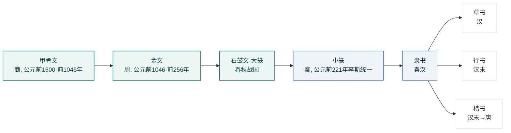
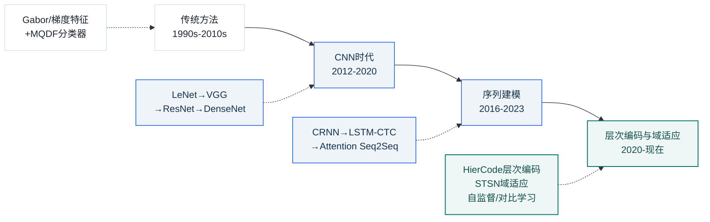
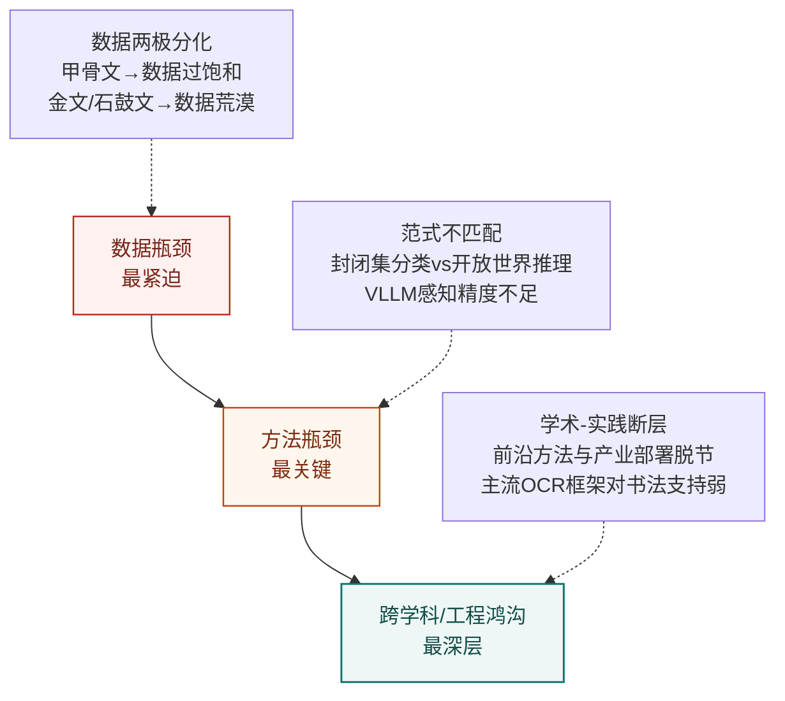

# 汉字书法字体识别技术综述
## ——从甲骨文到楷书的计算识别方法、数据集与前沿进展

### 摘要

汉字书法字体识别是模式识别与数字人文交叉领域的重要课题，涵盖甲骨文、金文、石鼓文、篆书、隶书、草书、行书、楷书等跨越三千余年的八种主要字体。本文系统综述了该领域的技术现状、数据集资源和前沿进展。主要发现包括：(1) 八种字体的识别技术发展呈现极端的两极分化格局——甲骨文因考古破译需求驱动成为研究最活跃的子领域（2023-2026年间产出15+篇顶会论文），楷书因通用OCR生态驱动达到实用水平（识别准确率超过97%），而金文、石鼓文和隶书近乎"技术荒漠"；(2) 从刘成林团队的MQDF分类器和CASIA-HWDB数据集[13]，到金连文团队的领域知识融合方法[30][31]和SCUT-COUCH2009数据库[28]，再到近年扩散模型与VLLM驱动的甲骨文破译[18][19][21][24]，领域方法论基石与中国团队的前沿推进一脉相承；(3) 技术范式正在经历从"封闭集分类"到"AI辅助探索未知"的根本性转变，扩散模型和视觉-语言大模型（VLLM）成为2023-2026年间最具突破性的方法进展——生成与识别从分离走向协同；(4) 计算古文字学（Computational Chinese Paleography）作为独立交叉学科正在形成共识，但数据稀缺（特别是金文和石鼓文）和VLLM的视觉感知精度短板仍是核心瓶颈。本文最后提出了面向数据荒漠字体的少样本基准建设、部首锚定的跨字体统一识别、以及Agent驱动的考古研究助理等五个优先研究方向。

**关键词**：汉字书法字体识别；甲骨文识别；古文字识别；深度学习；视觉-语言大模型；扩散模型；计算古文字学

---

### 1 引言

汉字是世界上唯一仍在广泛使用的自源文字系统，其三千余年的演化历程形成了甲骨文、金文、石鼓文、篆书、隶书、草书、行书、楷书等风格各异的字体谱系。这些字体不仅在文字学上具有重要研究价值，其计算机自动识别对于文化遗产数字化保护、考古研究辅助、历史文献整理等领域具有不可替代的应用意义。

汉字书法字体识别面临着通用OCR系统难以处理的独特挑战：从三千年前刻于龟甲上的高度象形化甲骨文，到极度简省连笔的狂草，不同字体在字形结构、标准化程度、风格变异度和载体退化程度上差异悬殊。近年来，随着深度学习技术的快速迭代——特别是Transformer架构、视觉-语言大模型（VLLM）和扩散模型的出现——该领域正经历着从传统图像处理到AI辅助文字学研究的范式跃迁。

本文旨在为计算机视觉、模式识别和数字人文领域的研究者提供一份系统性的技术综述。综述范围涵盖八种主要字体，时间跨度聚焦于2005-2026年，重点关注2015年后深度学习驱动的突破性进展。本文不涵盖印刷体汉字OCR（已有成熟综述）、以生成为主而不涉及识别的字体风格迁移工作，以及非汉语文字系统（如藏文、东巴文等）。

---

### 2 汉字书法字体演化与识别难点

#### 2.1 八种字体的历史演化

汉字字体沿以下时间线演化，共同构成从象形到抽象的连续谱系：

**关键演化节点**：(1) **隶变**（篆→隶）是最剧烈的字形变化——从圆转曲线变为方折笔画；(2) **草化**（隶→草）和**楷化**（隶→楷）代表了简省与规范化的两条路径；(3) **行书**是楷书与草书之间的折中。学术文献近年来普遍采用"Seven Chinese Scripts"[1]或"六体"[2]作为标准框架。

从文字学角度看，隶变之后的汉字被归入"今文字"范畴，而隶变之前（甲骨文、金文、篆书）则属于"古文字"范畴。这一"古/今"二分为识别技术提供了天然的难度分层——古文字识别主要依赖考古图片（龟甲、青铜器拓片），而今文字（楷、行、草）则有大量纸质手写样本可供训练。利用六书理论（象形、指事、会意、形声、转注、假借）分析汉字结构的工作为部首锚定的识别策略提供了文字学基础。

#### 2.2 各字体计算特征对比

从模式识别角度，八种字体的关键差异体现在字形复杂度、风格变异度、数据可得性和载体退化程度四个维度上：

| 字体 | 年代 | 载体 | 字符集规模 | 标准化程度 | 风格变异 | 图像退化 | 识别难度评估 |
|---|---|---|---|---|---|---|---|
| 甲骨文 | 商 | 龟甲/兽骨 | ~4,600（仅1,500可识） | 极低 | 高 | 极严重 | **极高** |
| 金文 | 周 | 青铜器 | 数千 | 低 | 中-高 | 严重 | **很高** |
| 石鼓文 | 战国 | 石刻 | 极有限（~718字） | 低 | 中 | 严重 | **极高**（数据极度稀缺） |
| 篆书（大/小） | 周秦 | 多载体 | 小篆 ~9K字 | 小篆高，大篆低 | 大篆高 | 中等 | **中-高** |
| 隶书 | 秦汉 | 简帛/石刻 | 较大 | 中-高 | 中 | 中等 | **中** |
| 草书 | 汉至今 | 纸 | 较大 | 极低 | 极高 | 低 | **极高** |
| 行书 | 汉末至今 | 纸 | 很大 | 低-中 | 很高 | 低-中 | **高** |
| 楷书 | 唐至今 | 纸 | 极大（数万） | 高 | 中 | 低 | **低**（最成熟） |

识别难度主要由三个因素共同决定：**数据可得性**（甲骨文已破解约1,500字符，石鼓文不足800字，而楷书手写体数据集可达百万级）、**风格变异度**（草书和甲骨文类内方差极大）、**载体退化程度**（上古文字因埋藏和锈蚀导致图像噪声严重）。

#### 2.3 字体间迁移潜力

基于字形演化的连续性，不同字体间存在可被迁移学习利用的结构相似性。楷书→行书的迁移潜力最高（结构高度相似，仅笔画连接度不同），小篆→大篆/金文的迁移潜力次之（同属篆系，曲线特征共享），而楷书→甲骨文的直接迁移效果极差（间隔三千年演化，字形完全不同）。GEVO[6]验证了字形演化一致性信号可作为跨字体学习的有效约束，AMR-CCR[2]的Script-conditioned Injection模块可校准不同字体间的嵌入空间。ACCP/P³[9]提出的部首重构方法展示了利用汉字部首体系作为跨字体"锚点"的潜力——甲骨文中的"水"旁和楷书中的"氵"旁在语义上是同一实体，这种基于传统文字学知识的迁移策略值得进一步探索。

---

### 3 数据集与评价体系

#### 3.1 主要数据集全景

下表汇总了该领域的主要公开数据集和基准资源：

| 数据集 | 年份 | 发布团队/机构 | 字体覆盖 | 规模 | 标注粒度 | 代表任务 |
|---|---|---|---|---|---|---|
| CASIA-HWDB[13] | 2011 | 中科院自动化所 | 楷/行/草（手写） | 1,176,000图像（300书写者） | 字符级（在线+离线） | 手写汉字识别 |
| SCUT-COUCH2009[28] | 2009 | 华南理工大学 | 楷/行/草（无约束联机） | 11个子数据集（单字/词/句子） | 字符/词/句子级 | 无约束联机手写识别 |
| HCL2000[29] | 2009 | 哈工大 | 楷/行（脱机手写） | 大规模 | 字符级 | 脱机手写汉字识别 |
| 863计划基础数据库[27] | 2005 | 863计划项目组 | 多种手写 | 多级别 | 多粒度 | 信息处理标准化评测 |
| Oracle-241[5] | 2022 | 华南理工/华中科大 | 甲骨文 | 241类 | 字符级 | 封闭集甲骨文识别 |
| OBC306[5] | 2023 | 华南理工/中科院自动化所 | 甲骨文 | 306类 | 字符级 | 零样本甲骨文识别 |
| ACCID[10] | 2023 | 中科院自动化所等 | 古文字 | 字符+部首 | 部首类别/位置/结构 | 零样本古文字OCR |
| HUST-OBC[8] | 2024 | 华中科技大学 | 甲骨文 | 140,053图像 | 字符级（1,588已知+9,411未知） | 甲骨文识别与破译 |
| ACCP[9] | 2024 | — | 七体 | 七阶段字符 | 部首序列 | 跨字体破译 |
| OBI-Bench[7] | 2025 | — | 甲骨文 | 5,523多源图像 | 字符/碎片/拓片 | 23 LMM五任务评测 |
| MCCD[11] | 2025 | 华南理工等 | 10种书体 | 329,715图像 | 字符+书体+朝代+书家 | 书法识别与属性分类 |
| CalliBench[12] | 2025 | — | 书法（多体） | 全页书法 | 行/页级 | 页级书法上下文化识别 |
| Chronicles-OCR[1] | 2026 | — | 七体 | 2,800跨载体图像 | 跨时期标注 | VLLM跨时期感知四任务 |
| EvoCON[2] | 2026 | — | 六体 | 持续脚本接入 | 字符+语义/形状 | 持续字符识别+零样本 |

**核心数据集详解**：

- **CASIA-HWDB1.0/1.1**[13]由中科院自动化所国家模式识别重点实验室构建，现已成为全球手写汉字识别的事实标准基准。数据集包含GB2312-80一级字库3755类汉字和171个英文/数字符号，通过300位书写者采集1,176,000张手写图像，训练/测试集按4:1比例划分。
- **SCUT-COUCH2009**[28]由华南理工大学金连文团队构建，区别于CASIA-HWDB的关键特征是其**无约束书写**设计——书写者不受格子限制，模拟真实场景。该数据库包含11个子数据集，覆盖词级和句子级手写，已发表于IJDAR国际文档分析期刊。
- **863计划中文信息处理基础数据库**[27]由钱跃良等人在2005年构建，是国家级863计划的重要产出，包含手写字形等多种信息处理数据的标准化资源，为后续CASIA-HWDB等数据集的建设提供了规范基础。
- **MCCD**[11]（Multi-attribute Chinese Calligraphy Character Dataset，ICDAR 2025）是目前最全面的书法属性标注数据集，覆盖10种书体、329,715图像，精细标注了朝代和书家信息，为书法风格识别提供了关键数据支撑。

#### 3.2 各字体数据覆盖矩阵

| 字体 | 公开数据集数量 | 代表性数据集 | 样本充足度 | 标注丰富度 | 总体评估 |
|---|---|---|---|---|---|
| 甲骨文 | 7+ | HUST-OBC[8], Oracle-241[5], OBC306[5] | ★★★★★ | ★★★★★ | **最丰富** |
| 楷书（含手写） | 极多 | CASIA-HWDB[13], SCUT-COUCH2009[28], HCL2000[29] | ★★★★★ | ★★★★★ | **最丰富** |
| 行书 | 中等 | CASIA-HWDB[13], SCUT-COUCH2009[28], MCCD[11] | ★★★☆☆ | ★★★☆☆ | 中等 |
| 草书 | 中等 | SCUT-COUCH2009[28], MCCD[11] | ★★★☆☆ | ★★★☆☆ | 中等 |
| 篆书 | 中等 | MCCD[11], ACCID[10] | ★★★☆☆ | ★★★☆☆ | 中等 |
| 隶书 | 稀少 | MCCD[11]（作为子类） | ★★☆☆☆ | ★★☆☆☆ | 有限 |
| 金文 | 极少 | 无专项公开数据集 | ★★☆☆☆ | ★★☆☆☆ | **严重不足** |
| 石鼓文 | 无 | 无 | ★☆☆☆☆ | ★☆☆☆☆ | **极度匮乏** |

**核心发现**：数据覆盖呈现极端的"两端丰富、中间匮乏"特征——甲骨文（因考古考释需求驱动）和楷/行/草手写体（因通用OCR需求驱动）数据相对充足，而金文和石鼓文存在系统性数据缺口。甲骨文和手写汉字领域的数据基础设施（HUST-OBC[8]、CASIA-HWDB[13]、SCUT-COUCH2009[28]）基本完备，但金文虽有"中华字库"工程和"商周金文数字化处理系统"等数字化项目，却缺乏面向计算机视觉的公开标注数据集和专项识别系统。金文的识别难度实际上低于甲骨文（字形更规整、铭文笔迹通常比例清晰），但缺乏如甲骨文"破译"那样的明确应用驱动。隶书虽在汉字演化中地位关键（"隶变"是最大的字形变化），同样缺乏大规模专项识别系统。石鼓文（十面石鼓约718字）因数据极度稀缺，全局无任何公开工作。

#### 3.3 评价指标与主要基准

常用评价指标包括：字符级准确率（Top-1/Top-5/Top-10 Accuracy，用于封闭集分类）、字符错误率（CER，用于序列识别）、零样本准确率（评估未见字符类别的识别能力）、检索命中率（Top-K Recall，用于破译/字典检索场景）。

ICDAR 2013中文手写识别竞赛由刘成林团队组织[34]，使用CASIA-HWDB派生的竞赛数据集，是当时HCCR评测的标杆平台。参赛方案中，基于深度学习的DeepCNet[33]（稀疏CNN，590万参数）取得了96.42%的Top-1准确率，DropSample-DCNN[31]集成（10模型）达到97.06%，标志着深度学习在联机HCCR上对传统MQDF方法（94.85%基线[26]）的大幅超越。

OBI-Bench[7]（ICLR 2025）对23个LMM进行了五任务系统评测，揭示即使GPT-4o在细粒度字符区分任务上仍远低于普通人类。Chronicles-OCR[1]（2026）建立了首个跨时期的VLLM感知评测基准。

---

### 4 基础方法：从传统视觉到经典深度学习

汉字书法字体识别的方法演进可归纳为四个阶段：

#### 4.1 传统图像处理方法

深度学习普及前，识别主要依赖"预处理→特征提取→分类器"流水线。特征提取包括八方向梯度特征、Gabor滤波、弹性网格和HOG/SIFT。分类器方面，**修正二次判别函数（MQDF，刘成林团队）**[26]是该时期的SOTA，在CASIA-HWDB上达到当时最佳性能——联机HCCR准确率94.85%，成为后续所有深度学习方法对标的基础基线。金连文团队提出的方向分解蜂窝特征[23]和虚拟笔画（Imaginary Stroke）技术也是这一时期的重要贡献，后者通过在联机笔迹中插入"虚拟笔画"来处理草书的连笔问题。

从国家863计划延续下来的标准化努力同样值得关注——钱跃良等人[27]设计的中文信息处理基础数据库为后续CASIA-HWDB等数据集的方法评测提供了规范框架。

然而，这些手工特征在面对甲骨文的龟甲裂纹噪声和草书的极端连笔变形时，表达能力严重不足。

#### 4.2 卷积神经网络

CNN的引入实现了从手工特征到端到端学习的转变。LeNet-5变体在2011年首次应用于手写汉字识别；VGG和ResNet的深层架构显著提升了特征提取质量；DenseNet的密集跳跃连接对书法字体识别尤为有效——各层特征复用有助于同时保留笔画细节和整体结构。

关键工作包括：

- **多列深度神经网络（MCDNN）**[26]：最早的端到端CNN方案，在CASIA-OLHWDB1.1上取得94.39%准确率。
- **DeepCNet**[33]（Graham，ICDAR 2013竞赛第一名）：稀疏CNN模型仅590万参数，在ICDAR 2013联机手写汉字竞赛中取得96.42%的Top-1准确率和97.39%的竞赛数据集准确率。
- **领域知识融合的DCNN**[30]（杨维信、金连文等，ICDAR 2015）：将传统领域知识（数据生成技术、方向变换特征、路径积分特征、伪样本变形）显式集成入CNN训练管线，取得96.35%的准确率。
- **DropSample-DCNN**[31]（杨维信、金连文等，2015）：从心理学遗忘规律得到启发的新型训练策略。集成9个DropSample模型后达到97.06%的准确率（CASIA-OLHWDB1.1），超越传统MQDF方法超过2个百分点。
- **HCCR-GoogLeNet**[26]（钟卓耀等，2016）：10模型集成后在ICDAR 2013脱机手写竞赛集上达到96.74% Top-1的当时最佳准确率。
- **结构-纹理分离网络（STSN）**[14]（Wang et al., TIP 2022）：通过生成模型将甲骨文字符分解为"字形结构"和"纹理噪声"两部分，在结构空间中进行无监督域适应，成功将手拓甲骨文知识迁移到扫描域。
- **深度可变形配准笔画提取**[16]（Li et al., AAAI 2023 Oral）：将笔画建模为七类语义分割问题，在书法字符和手写字符数据集上显著优于传统形态学方法。

此外，作者本人曾在ResNet50基础上对5种书法字体进行了识别实验，验证了经典CNN架构在书法字体分类中的实用性。

金连文团队在2016年《自动化学报》上发表的综述[26]对2010-2016年间的HCCR深度学习方法进行了系统整理，覆盖了传统方法到CNN、RNN、SAE的完整方法论演进，并附有详细的性能对比表格，是这一阶段最具代表性的方法论文献。

#### 4.3 序列建模与注意力机制

对行书和草书等连笔字体，单字符分割几乎不可能。CRNN（CNN+LSTM+CTC）成为标准方案，通过Connectionist Temporal Classification解决序列对齐问题，无需预分割即可实现端到端行级识别。基于注意力机制的Seq2Seq模型进一步提升了灵活性——解码时动态选择输入帧——但对草书极端变形易产生注意力漂移。

手写文本行识别在此阶段面临的"文本行级别识别率偏低"问题被文献反复提及。金连文综述[26]指出，2016年时联机手写文本行的最好CER仅约5%，而脱机的最好CER约10%，以整行为单位的行级准确率更低。此外，空间注意力和通道注意力分别用于聚焦笔画密集区域和抑制噪声通道，与STSN[14]的结构-纹理分离思路一脉相承。

#### 4.4 层次编码

**HierCode**[15]（Zhang et al., Pattern Recognition 2025）是该阶段的代表性工作。它利用汉字的部首层次结构设计轻量级层次编码本：通过多热编码策略结合层次二叉树编码和原型学习，在五个基准（手写、场景、文档、网页和古文字）上实现了传统和零样本中文文本识别的SOTA，且参数量显著低于传统one-hot方案。

---

### 5 前沿方法：Transformer、大模型与生成式识别

2023-2026年间，汉字书法字体识别经历了比前五年更剧烈的范式变革，主要体现在三个方向。

#### 5.1 扩散模型：生成与识别的协同

扩散模型在古文字识别中扮演着"数据增强器"和"破译线索生成器"的双重角色：

| 方法 | 发表 | 核心策略 | 关键性能 |
|---|---|---|---|
| Diff-Oracle[18] | 2023 | 可控制扩散：风格编码器+内容编码器，预训练VL模型提取风格嵌入 | OBC306零样本准确率 **84.62%**（+7.70%） |
| OBSD[19] | ACL 2024 Best Paper | 条件扩散生成破译线索，从图像生成角度解决破译 | 定性突破 |
| OracleFusion[21] | ICCV 2025 | MLLM空间感知推理+结构约束向量融合字型生成 | 语义/视觉/字形保持全面超越SOTA |
| UniCalli[25] | 2025 | 统一扩散框架：列级识别+生成联合训练，非对称噪声+布局先验 | 识别生成双向增强 |
| 生成式字典检索[20] | 2026（Nature MI审稿中） | 演化引导的合成字典，重定义破译为检索而非分类 | 未见字符Top-10 **54.3%**、Top-50 **86.6%** |

这些工作的核心范式转变在于：**不再假设所有待识别字符都属于已知类别**。Diff-Oracle通过生成训练数据弥补零样本类别的图像缺失，OBSD从根本上论证了图像生成可为文字破译提供比NLP方法更有效的线索，而生成式字典检索则彻底跳出了分类范式。

#### 5.2 视觉-语言大模型（VLLM）：从识别到理解

VLLM正在将古文字识别从"图像→类别"扩展为"图像→视觉理解→知识推理→解释"：

| 系统 | 发表 | 核心方法 | 关键结果 |
|---|---|---|---|
| OBI-Bench[7] | ICLR 2025 | 23 LMM（GPT-4o/Gemini/Qwen-VL等）五任务系统评测 | 细粒度感知远低于人类；破译≈未训练人类 |
| OracleSage[23] | 2024 | LLaVA微调+层次视觉-语义理解+图语义推理 | 显著优于基线VLM |
| OracleAgent[22] | 2025 | Agent编排多工具+140万拓片知识库 | 多项推理生成任务超越GPT-4o |
| CalliReader[12] | ICCV 2025 | CalliAlign视觉-文本对齐+嵌入指令微调（e-IT） | **超越人类专家**在页级书法识别解读 |
| GEVO[6] | ACL 2026 | 字形驱动的MLLM微调框架 | 11任务全面提升 |
| OB-Radix[24] | 2026 | VLM+部件定位+图知识检索+LLM推理链 | 最精细化的OBS破译系统 |
| Chronicles-OCR[1] | 2026 | 七体跨时期VLLM感知基准 | 暴露当前VLLM在历史文字感知上的系统局限 |

一个值得深究的发现是：VLLM在**语义推理层面**（提出破译假说）接近可用，但在**细粒度视觉感知层面**（如区分两个形近的甲骨文字符）仍远低于人类。OBI-Bench[7]将此明确归因为"视觉编码器的感知精度瓶颈"。然而CalliReader[12]通过精心设计的训练策略证明这一瓶颈并非不可逾越。

#### 5.3 少样本、零样本与跨字体泛化

解决数据稀缺的另一个关键方向是少样本和零样本学习：

- **HierCode**[15]（PR 2025）：层次编码本实现通用零样本汉字识别
- **ACCP/P³**[9]（ICDAR 2024）：Transformer部首重构将甲骨文"翻译"为现代对应字
- **AMR-CCR**[2]（2026）：锚定模块化检索实现六脚本的持续学习式统一识别
- **Bézier反编译**[30]（2025）：VLM将汉字光栅图像"反编译"为贝塞尔曲线程序，仅用现代汉字训练即可零样本重建甲骨文

#### 5.4 生成-识别协同范式

综合以上进展，一个清晰的趋势正在形成：**生成与识别正在从分离走向协同**。UniCalli[25]直接在扩散框架内联合训练识别与生成——识别约束生成器保持结构精度，生成提供风格和布局先验，双任务相互增强。这一范式对古文字这一天然"数据稀缺+问题开放"的领域具有独特的适配价值。

---

### 6 各字体识别技术现状与对比

#### 6.1 八种字体研究热度与成熟度总览

| 字体 | 研究热度 | 技术成熟度 | 专用方法数量（2023-2026） | 代表性SOTA |
|---|---|---|---|---|
| 甲骨文 | ★★★★★ | ★★★☆☆ | 15+ | 零样本84.62%（Diff-Oracle[18]）；字典检索Top-10 54.3%（[20]） |
| 楷书 | ★★★★★ | ★★★★★ | 极多 | Top-1 > 97%（CASIA-HWDB[13]）；DropSample-DCNN 97.06%（[31]） |
| 行书 | ★★★★☆ | ★★★★☆ | 较多 | CalliReader[12]超越人类专家（ICCV 2025）；UniCalli[25]联合框架 |
| 草书 | ★★★★☆ | ★★★☆☆ | 较多 | CRNN/CTC成熟方案；CalliReader[12]页级识别 |
| 小篆 | ★★★☆☆ | ★★★☆☆ | 中等 | ACCID[10]部首分解零样本（ACM MM 2023） |
| 隶书 | ★★☆☆☆ | ★★☆☆☆ | 稀少 | 仅多脚本框架覆盖（Chronicles-OCR[1], MCCD[11]） |
| 金文 | ★☆☆☆☆ | ★☆☆☆☆ | 极稀少 | 无专项系统（仅ACCP[9]/EvoCON[2]/Chronicles-OCR[1]中作为子类） |
| 大篆/石鼓文 | ☆☆☆☆☆ | ☆☆☆☆☆ | 无 | 无任何公开工作 |

#### 6.2 甲骨文：研究最活跃的古文字字体

甲骨文识别是当前研究投入最密集的子领域，方法谱系覆盖从传统域适应（STSN[14]，TIP 2022）到扩散模型（Diff-Oracle[18]，OBSD[19] ACL 2024 Best Paper）到VLLM Agent（OracleAgent[22]，OracleSage[23]，OB-Radix[24]）的完整链条。华中科技大学（HUST-OBC[8]、OracleAgent[22]）、华南理工大学（Oracle-241、OBC306[5]、Diff-Oracle[18]）、中科院自动化所（ACCP/P³[9]、OBI-Bench[7]）和安阳师范学院（甲骨文信息处理教育部重点实验室）构成了该领域的核心研究力量。

封闭集识别已达高精度，零样本识别在Diff-Oracle[18]的84.62%上取得突破，而生成式字典检索[20]将未见字符的Top-10命中率提升至54.3%（远优于传统分类方法的<3%）。甲骨文方向的论文在2023-2026年间呈现爆发式增长，顶会（ACL、ICCV、ICLR）和顶刊（Nature MI审稿中）均有收录。

值得强调的是，甲骨学研究的文字学知识（如缀合信息、分期断代、字词典数据）已被编码入OB-Radix[24]等前沿系统的部件定位和图知识检索模块中，体现了计算古文字学中领域知识与AI方法深度融合的趋势。

#### 6.3 楷书与行书：成熟领域的迁移价值

楷书手写体识别是技术最成熟的子领域（CASIA-HWDB[13] Top-1 > 97%），其训练方法可部分迁移至行书和隶书。金连文团队的DropSample-DCNN[31]在2015年即实现97.06%的CASIA联机手写准确率，标志着CNN方法在此任务上的成熟。行书识别受益于CRNN/CTC序列建模的成熟方案和CalliReader[12]的VLM突破，已达到高实用水平。但楷书→篆书的直接迁移效果显著下降（曲线vs直线的笔画差异），而楷书→甲骨文的迁移几无效果（字形演化距离过大）。

白翔团队（华中科大）在全球场景文字识别领域有重要影响力，其工作侧重自然场景中的文字检测与识别，近年来向古文字方向拓展，HUST-OBC[8]数据集即为团队贡献。

#### 6.4 草书：连笔简省的独特挑战

草书面临笔画连写、简省变形、极高书家风格变异和异体字四大挑战。金连文团队早期提出的"虚拟笔画"技术（在联机笔迹序列中插入不存在的笔迹段连接笔画间断处）代表了这一挑战的早期应对策略。CalliReader[12]（ICCV 2025）通过CalliAlign视觉-文本对齐和e-IT嵌入指令微调，在页级书法识别上超越人类专家，是目前最先进的书法识别系统。但狂草的极端简省（如怀素《自叙帖》）是否可被自动化稳定识别，仍是一个开放性难题。

#### 6.5 书法风格识别

书法风格识别（书体分类、书家鉴定、朝代判定、真伪鉴别）是该领域一个重要的研究分支，其独特价值体现在：

- **书写者识别（Writer Identification）**：金连文团队DeepWriterID[32]系统利用路径积分特征+DropStroke+深度CNN，从笔迹中识别书写者身份
- **书法属性分类**：MCCD数据集[11]（ICDAR 2025）包含10种书体、329,715图像，精细标注了朝代和书家信息，是目前最全面的书法属性标注数据集
- **书法真伪鉴定**：在书画保护领域有实际应用前景，但系统性的算法研究仍较少

传统书法理论中的"永字八法"（将汉字笔画归纳为八类基本形态）为方向梯度特征提取提供了直观的笔画语义支持，而"六书"造字法为部首分解识别策略提供了文字学基础。但目前将这些传统书法理论显式编码进深度学习框架的系统性工作仍不多，主要在特征设计的直觉启发层面起作用。

#### 6.6 金文、石鼓文、隶书：系统性研究空白

这三种字体构成了领域中最令人忧虑的技术荒漠。金文虽有青铜器铭文数字化项目（如"中华字库"工程和"商周金文数字化处理系统"），但缺乏计算机视觉格式的公开标注数据集和专项识别系统。金文的识别难度实际上低于甲骨文（字形更规整、铭文笔迹通常比例清晰），但缺乏如甲骨文"破译"那样的驱动研究投入的独特价值主张。石鼓文（十面石鼓约718字）因数据极度稀缺，全局无任何识别工作。隶书虽在汉字演化中地位关键（"隶变"是最大的字形变化），但缺乏大规模专项识别系统。这一格局的根本原因不是技术难度，而是缺乏驱动研究投入的独特应用场景。

---

### 7 挑战与未来方向

#### 7.1 三层核心瓶颈

当前领域的核心挑战可归纳为三个层次：

**第一层（数据瓶颈）**：不仅是"数据少"，而是结构性的两极分化——甲骨文因考古破译驱动获得7+专门数据集，而金文和石鼓文近乎空白。没有公开基准的领域无法形成迭代优化的学术循环。

**第二层（方法瓶颈）**：不在于精度不够，而在于范式不匹配——甲骨文破译是开放世界推理任务，但多数方法仍用封闭集分类；VLLM在语义推理上强，在细粒度视觉感知上弱（OBI-Bench[7]明确结论）。

**第三层（跨学科/工程鸿沟）**：Ma[3]将其总结为"AI能力与人文研究的整体性本质之间的脱节"——技术论文追求单一任务精度指标，文字学家的实际工作流程需要集成化的数字生态系统。同时，产业界的实用化需求（推理速度、移动端部署、小样本适应）与学术前沿（扩散模型并行计算密集、VLLM模型规模庞大）之间存在显著断层。PaddleOCR等主流OCR框架对手写/书法字体的支持明显弱于印刷体。金连文综述[26]中提出的"超大类别27533字实用化"和"无约束重叠书写"问题至今仍是未能解决的核心瓶颈。

#### 7.2 已解决 vs 仍开放的问题

| 问题类别 | 状态 | 说明 |
|---|---|---|
| 楷书单字识别 | ✅ 基本解决 | CASIA-HWDB[13] Top-1 > 97% |
| 手写行书识别 | ✅ 较好解决 | CRNN/CTC序列方法成熟 |
| 字体风格分类 | ✅ 较好解决 | VLLM在多体分类任务上表现好 |
| 封闭集甲骨文识别 | ⚠️ 部分解决 | Oracle-241性能好，但扩展性差 |
| 零样本甲骨文识别 | 🔄 快速进展 | Diff-Oracle[18] 84.62%，字典检索[20] 54.3% |
| 金文/石鼓文/隶书专项 | ❌ 未解决 | 尚无专项系统或公开基准 |
| 狂草/章草稳定识别 | ❌ 未解决 | CalliReader[12]有进展但覆盖不全 |
| 超大类别（27533字）手写识别 | ❌ 未解决 | 缺乏公开训练集和评测基准 |
| 无约束重叠书写识别 | ❌ 未解决 | 金连文2016综述[26]即提出，至今未解决 |
| 跨字体统一识别 | 🔄 早期阶段 | AMR-CCR[2]、UniCalli[25]等框架起步 |
| 可解释破译 | 🔄 早期阶段 | 字典检索[20]、OracleAgent[22]等开始探索 |
| 书法手写OCR实用化部署 | ❌ 未解决 | 主流OCR框架对手写/书法支持弱 |

#### 7.3 五个优先研究方向

**方向1：面向"数据荒漠"字体的少样本基准建设**（优先级：最高）

金文、石鼓文、隶书缺乏任何公开基准，导致学术循环无法启动。建议由数字人文社区牵头，为每种字体构建至少1,000-5,000样本的最小验证集，将Chronicles-OCR[1]/EvoCON[2]基准扩展至全八体覆盖。

**方向2：感知精度增强的VLLM微调策略**（优先级：高）

OBI-Bench[7]明确揭示当前VLLM在细粒度视觉感知上的短板。GEVO[6]（ACL 2026）的字形驱动微调提供一个可行方向——探索视觉编码器的分层微调，在保持高层语义理解的同时增强低层笔画感知能力。将"永字八法"笔画分类知识和"六书"造字法作为可训练的结构先验嵌入视觉编码器，是值得探索的路径。

**方向3：部首锚定的跨字体统一识别**（优先级：高）

基于ACCP[9]/HierCode[15]的部首分解策略和"六书"文字学理论，构建跨字体的共享部首嵌入空间作为中间表示层。AMR-CCR[2]的持续学习范式可作为新字体接入的增量方案。该方向的核心思想是：部首是跨越三千年的不变锚点——甲骨文中的"水"旁和楷书中的"氵"旁在语义上是同一实体。

**方向4：从识别到理解的端到端考古助理系统**（优先级：中）

整合Chronicles-OCR[1]的多任务评估和OracleAgent[22]的Agent编排，构建"定位→识别→缀合→断代→破译→解读"全链条智能助理。Ma[3]所倡导的"集成化数字生态系统"需要前三个方向的突破作为基础。

**方向5：面向实用化部署的轻量书法识别方案**（优先级：中）

产业界的工程实践表明，现有学术方法的推理速度和模型大小严重制约实用化落地。需发展面向移动端和低资源场景的轻量书法/手写识别模型，弥合PaddleOCR等主流OCR框架在书法字体上的能力缺口。同时，面向GBK大字集（27533字）的实用化OCR训练和模型压缩，仍然是手写汉字识别中最贴近产业需求的未解决方向[26]。

---

### 8 结论

汉字书法字体识别技术正处于一个历史性的转折点上——正在经历从"分类已知"到"探索未知"、从"孤立模型"到"智能体系统"、从"计算机视觉应用"到"独立交叉学科"的三重转变。

**在方法层面**，该领域已积累了包含MQDF分类器[26]、CASIA-HWDB数据集[13]、DropSample领域知识融合方法[30][31]等在内的坚实基础。扩散模型（Diff-Oracle[18], OBSD[19], UniCalli[25]）和视觉-语言大模型（CalliReader[12], OracleAgent[22], GEVO[6]）代表了2023-2026年间最具突破性的进展，它们共同将古文字识别从封闭集分类推向开放世界推理。领域知识融合的范式（DropSample[31]、路径积分、虚拟笔画等）与端到端生成式范式之间有价值的互补正在形成。

**在学科层面**，Computational Chinese Paleography的正式提出[3]和顶会持续收录标志着从零散论文到学科共识的形成。甲骨文信息处理教育部重点实验室等专门机构的设立更标志着交叉学科的制度化推进。

**在核心挑战层面**，领域面临的核心矛盾仍然尖锐：技术资源高度集中于甲骨文和楷书两个端点，而金文、石鼓文、隶书等"中间字体"近乎技术荒漠。这种不均衡性既是领域最大的挑战，也蕴含着最重要的研究机遇。学术前沿与产业界工程实践之间的断层同样显著——学术论文追求指标突破，产业界需求聚焦于轻量化部署和超大类别覆盖。

在更长期的视角下，成功的关键不在于单一技术的精度提升，而在于构建真正服务于文字学家的"集成化数字生态系统"[3]——让AI的推理逻辑与考古学者的认知方式相互适配，让前沿算法通过主流工具下沉到实际应用场景中。为被系统性忽视的字体构建最小基准数据集并验证少样本方法的可行性，将是下一个五年最紧迫的研究议程。

---

*本综述的时间范围为2005-2026年，重点关注2020年后深度学习驱动的进展。文献来源涵盖arXiv、IEEE Xplore、ACM Digital Library、《自动化学报》等学术数据库以及相关技术社区。*

---

### 参考文献

[1] Li G, Peng S, Wan X, et al. Chronicles-OCR: A Cross-Temporal Perception Benchmark for the Evolutionary Trajectory of Chinese Characters. arXiv:2605.11960, 2026.

[2] Wu Y, Zhu Y, Yu H, et al. AMR-CCR: Anchored Modular Retrieval for Continual Chinese Character Recognition. arXiv:2603.07497, 2026.

[3] Ma Y R. Towards Computational Chinese Paleography. arXiv:2601.06753, 2026. (Peking University & ByteDance Digital Humanities Open Lab)

[4] Diao X, Bo R, Xiao Y, et al. Ancient Script Image Recognition and Processing: A Review. arXiv:2506.19208, 2025.

[5] Li J, Chi X, Wang Q, et al. A Comprehensive Survey of Oracle Character Recognition: Challenges, Benchmarks, and Beyond. arXiv:2411.11354, 2024.

[6] Song R, Shi L, Qi R, et al. Enhancing Multimodal Large Language Models for Ancient Chinese Character Evolution Analysis via Glyph-Driven Fine-Tuning. In: Proceedings of ACL, 2026.

[7] Chen Z, Chen T, Zhang W, et al. OBI-Bench: Can LMMs Aid in Study of Ancient Script on Oracle Bones? In: Proceedings of ICLR, 2025.

[8] Wang P, Zhang K, Wang X, et al. An Open Dataset for Oracle Bone Script Recognition and Decipherment. arXiv:2401.15365, 2024.

[9] Wang P, Zhang K, Wang X, et al. Puzzle Pieces Picker: Deciphering Ancient Chinese Characters with Radical Reconstruction. In: Proceedings of ICDAR, 2024.

[10] Diao X, Shi D, Li J, et al. Toward Zero-shot Character Recognition: A Gold Standard Dataset with Radical-level Annotations. In: Proceedings of ACM MM, 2023.

[11] Zhao Y, Zhang Y, Jin L. MCCD: A Multi-Attribute Chinese Calligraphy Character Dataset Annotated with Script Styles, Dynasties, and Calligraphers. In: Proceedings of ICDAR, 2025.

[12] Luo Y, Tang J, Huang C, et al. CalliReader: Contextualizing Chinese Calligraphy via an Embedding-Aligned Vision-Language Model. In: Proceedings of ICCV, 2025.

[13] Liu C-L, Yin F, Wang D-H, et al. CASIA Online and Offline Chinese Handwriting Databases. In: Proceedings of ICDAR, 2011.

[14] Wang M, Deng W, Liu C-L. Unsupervised Structure-Texture Separation Network for Oracle Character Recognition. IEEE Transactions on Image Processing, 2022.

[15] Zhang Y, Zhu Y, Peng D, et al. HierCode: A Lightweight Hierarchical Codebook for Zero-shot Chinese Text Recognition. Pattern Recognition, 2025.

[16] Li M, Yu Y, Yang Y, et al. Stroke Extraction of Chinese Character Based on Deep Structure Deformable Image Registration. In: Proceedings of AAAI (Oral), 2023.

[17] Chang B, Zhang Q, Pan S, et al. Generating Handwritten Chinese Characters using CycleGAN. In: Proceedings of WACV, 2018.

[18] Li J, Wang Q-F, Wang S, et al. Diff-Oracle: Deciphering Oracle Bone Scripts with Controllable Diffusion Model. arXiv:2312.13631, 2023.

[19] Guan H, Yang H, Wang X, et al. Deciphering Oracle Bone Language with Diffusion Models. In: Proceedings of ACL (Best Paper), 2024.

[20] Wu Y, Zhang G, Chen J, et al. Decoding Ancient Oracle Bone Script via Generative Dictionary Retrieval. arXiv:2604.09668, 2026. (under review at Nature Machine Intelligence)

[21] Li C, Ding Z, Hu X, et al. OracleFusion: Assisting the Decipherment of Oracle Bone Script with Structurally Constrained Semantic Typography. In: Proceedings of ICCV, 2025.

[22] Li C, Ding Z, Hu X, et al. OracleAgent: A Multimodal Reasoning Agent for Oracle Bone Script Research. arXiv:2510.26114, 2025.

[23] Jiang H, Pan Y, Chen J, et al. OracleSage: Towards Unified Visual-Linguistic Understanding of Oracle Bone Scripts through Cross-Modal Knowledge Fusion. arXiv:2411.17837, 2024.

[24] Zhang J, Li R, Pang H, et al. Specializing Large Models for Oracle Bone Script Interpretation via Component-Grounded Multimodal Knowledge Augmentation. arXiv:2604.06711, 2026.

[25] Xu T, Wang K, Chen Z, et al. UniCalli: A Unified Diffusion Framework for Column-Level Generation and Recognition of Chinese Calligraphy. arXiv:2510.13745, 2025.

[26] 金连文, 钟卓耀, 杨钊, 杨维信, 谢泽澄, 孙俊. 深度学习在手写汉字识别中的应用综述. 自动化学报, 2016, 42(8): 1125-1141. doi: 10.16383/j.aas.2016.c150725

[27] 钱跃良, 林守勋, 刘群, 刘洋, 刘宏, 谢萦. 863计划中文信息处理与智能人机接口基础数据库的设计和实现. 高技术通讯, 2005, 15(1): 107-110.

[28] Jin L W, Gao Y, Liu G, Liu G Y, Li Y Y, Ding K. SCUT-COUCH2009——A Comprehensive Online Unconstrained Chinese Handwriting Database and Benchmark Evaluation. IJDAR, 2011, 14(1): 53-64.

[29] Zhang H G, Guo J, Chen G, Li C G. HCL2000——A Large-scale Handwritten Chinese Character Database for Handwritten Character Recognition. In: Proceedings of ICDAR, 2009.

[30] Yang W X, Jin L W, Xie Z C, Feng Z Y. Improved Deep Convolutional Neural Network for Online Handwritten Chinese Character Recognition Using Domain-Specific Knowledge. In: Proceedings of ICDAR, 2015.

[31] Yang W X, Jin L W, Tao D C, Xie Z C, Feng Z Y. DropSample: A New Training Method to Enhance Deep Convolutional Neural Networks for Large-Scale Unconstrained Handwritten Chinese Character Recognition. arXiv:1505.05354, 2015.

[32] Yang W X, Jin L W, Liu M F. DeepWriterID: An End-to-End Online Text-Independent Writer Identification System. arXiv:1508.04945, 2015.

[33] Graham B. Spatially-Sparse Convolutional Neural Networks. arXiv:1409.6070, 2014.

[34] Yin F, Wang Q F, Zhang X Y, Liu C L. ICDAR 2013 Chinese Handwriting Recognition Competition. In: Proceedings of ICDAR, 2013.

[35] 基于深度学习的汉字识别方法研究综述. 微纳电子与智能制造, 2020. doi: 10.19816/j.cnki.10-1594/tn.2020.03.073
